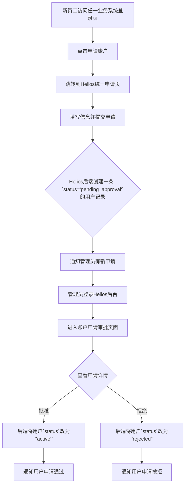
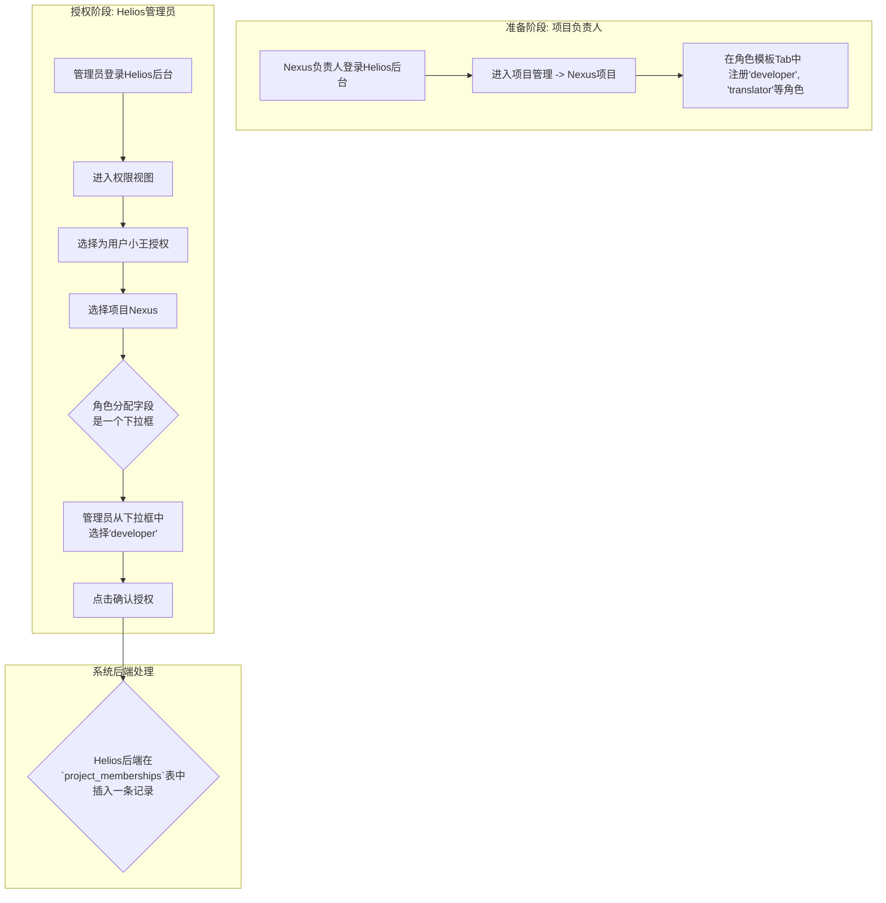

# PRD Helios用户中心

**1. 产品需求文档 (PRD): “Helios”**

|  |  |
| --- | --- |
| **文档版本:** | V2.0 (最终基线) |
| **项目代号:** | **Helios** (太阳神) |
| **核心定位:** | **部门级身份认证与授权中心 (IDaaS)** |

**1.1. 产品愿景**

为部门内所有应用系统提供一个统一、集中、且易于管理的 **用户身份认证与授权服务**。实现“一次申请，多次授权，处处使用”的安全、便捷的单点登录（SSO）体验。

**1.2. 核心原则**

- **统一身份:** 员工在Helios拥有唯一的账户。
- **申请-审批制:** 所有新账户的创建都必须经过管理员审批。
- **权责分离:**
    - **全局角色** (`users.role`) 决定用户在Helios后台的权限。
    - **本地角色** (`project_memberships.role_in_project`) 决定用户在具体业务项目中的权限。
- **集中授权:** 所有跨项目的授权操作，都必须在Helios管理后台集中进行。
- **模板化管理:** 业务项目负责人可以在Helios中预先注册其内部的角色模板，以简化和规范管理员的授权操作。

**1.3. 目标用户**

- **普通员工:** 申请一次账户，即可在被授权后使用所有内部系统。
- **部门/系统管理员:** 需要一个简单、直观、不易出错的后台来管理员工账户、审批申请和分配权限。
- **业务项目负责人:** 需要一个地方来定义和说明自己项目的角色。
- **业务系统 (API消费者):** 需要稳定可靠的API来验证用户身份和获取其在项目中的本地角色。

**1.4. 功能模块 (管理后台)**

1. **仪表盘 (Dashboard):** 作为后台首页，提供“待审批申请”的醒目入口和宏观数据统计。
2. **账户申请审批 (Account Approvals):** 集中处理新用户的账户申请（批准/拒绝）。
3. **项目管理 (Project Management):** 负责项目的生命周期管理，并允许项目负责人在此为自己的项目 **注册和管理角色模板**。
4. **用户管理 (User Management):** 管理已激活用户的生命周期和 **全局角色**。
5. **权限视图 (Permission Views):** 提供双向、灵活的授权管理界面，将用户与项目关联，并从 **角色模板** 中为其选择一个 **本地角色**。
6. **操作日志 (Audit Logs):** 记录所有关键管理操作，确保安全可追溯。

**2. 核心流程图**

**2.1. 新用户申请与审批流程**

**2.2. 管理员使用“角色模板”进行授权流程**

mermaid

源代码

**3. 数据库设计: “Helios”**

**3.1. `users` - 用户表**

| **字段名** | **数据类型** | **约束** | **解释** |
| --- | --- | --- | --- |
| `id` | `INT` | `PRIMARY KEY`, `AUTO_INCREMENT` | 唯一数字ID。 |
| `uuid` | `VARCHAR(36)` | `NOT NULL`, `UNIQUE` | 全局唯一标识符 (UUID)。 |
| `username` | `VARCHAR(50)` | `NOT NULL`, `UNIQUE` | 登录名。 |
| `email` | `VARCHAR(255)` | `NOT NULL`, `UNIQUE` | 电子邮箱。 |
| `password_hash` | `VARCHAR(255)` | `NOT NULL` | 哈希后的密码。 |
| `role` | `VARCHAR(30)` | `NOT NULL`, `DEFAULT 'user'` | **Helios系统全局角色** (如 `super_admin`, `user`)。 |
| `status` | `VARCHAR(20)` | `NOT NULL`, `DEFAULT 'pending_approval'` | **账户状态机:** `pending_approval`, `active`, `inactive`, `rejected`。 |
| `application_reason` | `TEXT` | `NULL` | 用户申请账户时填写的理由。 |
| `created_at` | `DATETIME` | `NOT NULL`, `DEFAULT CURRENT_TIMESTAMP` | 创建时间。 |
| `updated_at` | `DATETIME` | `NOT NULL`, `DEFAULT CURRENT_TIMESTAMP ON UPDATE CURRENT_TIMESTAMP` | 最后更新时间。 |

**3.2. `projects` - 项目表**

| **字段名** | **数据类型** | **约束** | **解释** |
| --- | --- | --- | --- |
| `id` | `INT` | `PRIMARY KEY`, `AUTO_INCREMENT` | 唯一数字ID。 |
| `project_name` | `VARCHAR(100)` | `NOT NULL` | 项目的友好名称。 |
| `project_id_string` | `VARCHAR(50)` | `NOT NULL`, `UNIQUE` | 项目的系统内唯一标识符。 |
| `description` | `TEXT` | `NULL` | 项目描述。 |
| `roles_documentation` | `TEXT` | `NULL` | 项目负责人填写的、关于本项目角色定义的Markdown格式说明文档。 |
| `created_at` | `DATETIME` | `NOT NULL`, `DEFAULT CURRENT_TIMESTAMP` | 创建时间。 |
| `updated_at` | `DATETIME` | `NOT NULL`, `DEFAULT CURRENT_TIMESTAMP ON UPDATE CURRENT_TIMESTAMP` | 最后更新时间。 |

**3.3. `project_role_templates` - 项目角色模板表**

| **字段名** | **数据类型** | **约束** | **解释** |
| --- | --- | --- | --- |
| `id` | `INT` | `PRIMARY KEY`, `AUTO_INCREMENT` | 唯一ID。 |
| `project_id` | `INT` | `NOT NULL`, `FOREIGN KEY (projects.id)` | 关联的项目ID。 |
| `role_name` | `VARCHAR(50)` | `NOT NULL` | 角色名称 (如 `developer`)。 |
| `description` | `TEXT` | `NULL` | 对这个角色的简单描述。 |
| **约束:** | `UNIQUE KEY (project_id, role_name)` |  |  |

**3.4. `project_memberships` - 项目成员关系表**

| **字段名** | **数据类型** | **约束** | **解释** |
| --- | --- | --- | --- |
| `id` | `INT` | `PRIMARY KEY`, `AUTO_INCREMENT` | 唯一ID。 |
| `user_id` | `INT` | `NOT NULL`, `FOREIGN KEY (users.id)` | 关联的用户ID。 |
| `project_id` | `INT` | `NOT NULL`, `FOREIGN KEY (projects.id)` | 关联的项目ID。 |
| `role_in_project` | `VARCHAR(50)` | `NOT NULL` | 用户在此项目中的 **本地角色**。 |
| `created_at` | `DATETIME` | `NOT NULL`, `DEFAULT CURRENT_TIMESTAMP` | 授权关系创建的时间。 |
| **约束:** | `UNIQUE KEY (user_id, project_id)` |  |  |

**3.5. `audit_logs` - 操作日志表**

(结构略，用于记录所有关键管理操作)

**4. API 核心交互**

**场景：** Nexus系统验证一个用户的请求。

1. **Nexus (客户端)** 向自己的后端发起请求，并在请求头中携带JWT。
`GET /api/i18n/entriesAuthorization: Bearer <jwt>`
2. **Nexus (后端)** 收到请求后，向 **Helios** 发起验证请求。它必须告诉Helios自己是谁。
`GET http://helios-service/api/auth/verify?project_id_string=nexus_i18nAuthorization: Bearer <jwt>`
3. **Helios (后端 )** 执行以下逻辑：
a. 验证JWT，解析出 `user_id`。
b. 根据 `project_id_string` 找到 `projects.id`。
c. 查询 `project_memberships` 表，找到 `user_id` 和 `project_id` 匹配的记录。
d. 如果找到，取出 `role_in_project` 字段的值。
4. **Helios (后端)** 向 **Nexus (后端)** 返回结果：JSON
    
    `{
      "is_valid": true,
      "user_id": 123,
      "username": "xiaowang",
      "role": "developer" // 这是小王在Nexus项目中的本地角色
    }`
    
5. **Nexus (后端)** 拿到这个结果，根据 `'developer'` 这个角色，执行自己内部的RBAC权限判断，最终决定是否执行业务逻辑并返回数据给 **Nexus (客户端)**。